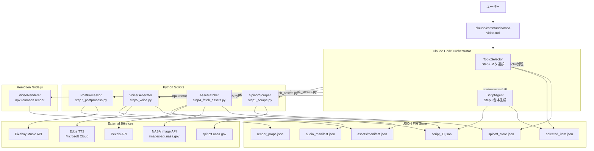
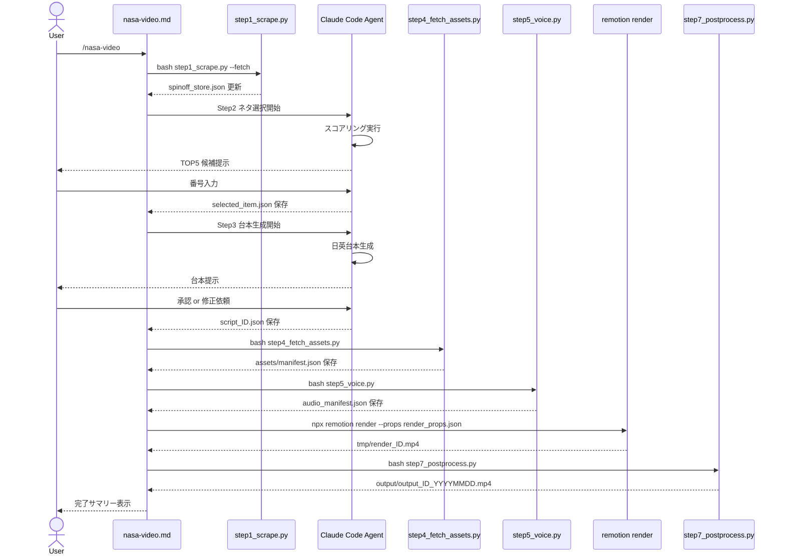
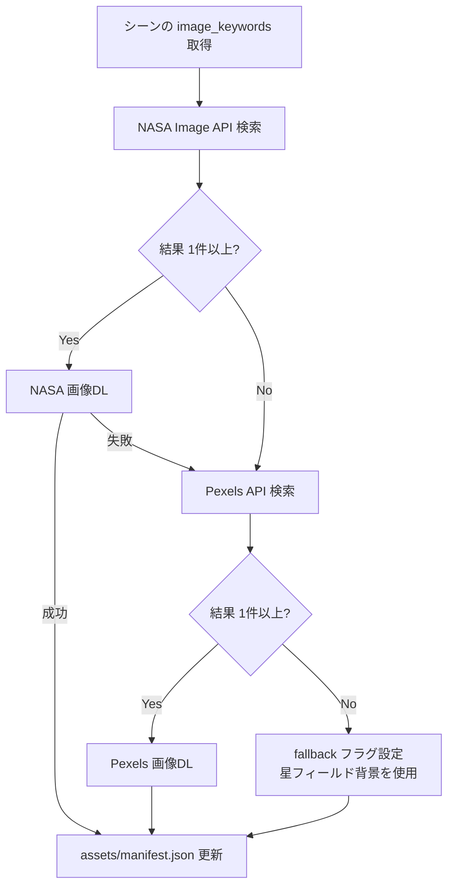
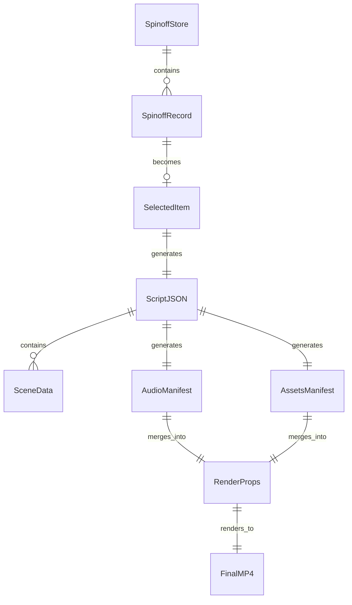

# 技術設計書: NASA Spinoff 自動動画生成パイプライン

## 概要

本パイプラインは、spinoff.nasa.govからNASA技術情報を自動収集し、Claude Codeとの会話を通じてYouTube Shorts向け縦型動画（9:16 / 1080×1920）を完全自動生成するシステムである。ユーザーは `/nasa-video` コマンドを入力するだけで、ネタ選択・台本生成・音声合成・動画レンダリング・BGMミックスを一貫して実行できる。

**ユーザー**: YouTubeショート動画コンテンツ制作者
**価値提供**: 手動リサーチ・編集不要でバズりやすいNASA技術動画を量産

### Goals

- `/nasa-video` 一発でエンドツーエンドの動画生成を完結させる
- バイラルスコアリングによりコンテンツ品質を向上させる
- 日英バイリンガル対応で視聴者層を拡大する
- 全素材（画像・音声・BGM）を自動取得し著作権問題を回避する

### Non-Goals

- YouTube への自動アップロード（本スコープ外）
- 複数動画の同時バッチ生成
- カスタムビジュアルデザインの編集UI
- ElevenLabs等有料TTSサービスの統合

---

## 要件トレーサビリティ

| 要件 | 概要 | コンポーネント | フロー |
|------|------|---------------|--------|
| 1.1〜1.7 | Spinoffスクレイピング・永続保存 | SpinoffScraper | メインパイプラインフロー |
| 2.1〜2.9 | バイラルスコアリング＆選択UI | TopicSelector | Step 2 フロー |
| 3.1〜3.7 | 台本生成・ユーザー承認 | ScriptAgent | Step 3 フロー |
| 4.1〜4.8 | 画像・動画素材取得 | AssetFetcher | Step 4 フロー |
| 5.1〜5.8 | 音声生成（JA/EN） | VoiceGenerator | Step 5 フロー |
| 6.1〜6.11 | Remotion動画レンダリング | VideoRenderer | Step 6 フロー |
| 7.1〜7.8 | FFmpeg BGMミックス | PostProcessor | Step 7 フロー |
| 8.1〜8.9 | パイプライン統合・スラッシュコマンド | Pipeline Orchestrator | メインパイプラインフロー |

---

## アーキテクチャ

### アーキテクチャパターン＆境界マップ

**選定パターン**: ファイルベース順次パイプライン + Claude Code オーケストレーター

Claude Code（`.claude/commands/nasa-video.md`）がオーケストレーターとなり、Pythonスクリプト・Remotion CLIをBashツール経由で呼び出す。ステップ間のデータ受け渡しはJSONファイルで行う。Step 2（ネタ選択）・Step 3（台本生成）はClaude Code自身が会話形式で処理する。



### テクノロジースタック

| レイヤー | 選択 / バージョン | 役割 | 備考 |
|---------|-----------------|------|------|
| Orchestrator / CLI | Claude Code slash command | パイプライン全体の進行制御・ユーザー対話 | `.claude/commands/nasa-video.md` |
| スクレイピング | Python 3.10+ / requests / BeautifulSoup4 | spinoff.nasa.gov HTMLパース | RSSなし・2段階スクレイピング |
| AI推論 | Claude Code Agent (claude-sonnet-4-6) | バイラルスコアリング・台本生成 | 外部APIキー不要 |
| 音声合成 | edge-tts 7.2.7 | JA/EN MP3生成 | APIキー不要、asyncio |
| 画像取得 | Python / requests | NASA API・Pexels API 呼び出し | NASA: キー不要 / Pexels: APIキー必要 |
| 動画レンダリング | Remotion 4.0.434 / React 18 / TypeScript | 1080×1920 MP4生成 | Node.js 16+ |
| 動画後処理 | FFmpeg (システムインストール) / ffmpeg-python | BGMミックス・最終MP4出力 | PATH設定必要 |
| BGM取得 | Python / requests / Pixabay Music API | フリーBGM自動取得 | APIキー必要 |
| データストア | JSON ファイル (`data/` / `assets/`) | ステップ間データ受け渡し | SQLite不使用（シンプルさ優先） |
| 設定管理 | python-dotenv / .env | APIキー等機密情報管理 | `.env.example` でテンプレート提供 |

---

## システムフロー

### メインパイプラインフロー



### 素材取得フォールバックフロー（Step 4）



---

## コンポーネントとインターフェース

### コンポーネントサマリー

| コンポーネント | レイヤー | 役割 | 要件カバレッジ | 主要依存 |
|--------------|---------|------|--------------|---------|
| Pipeline Orchestrator | Orchestration | パイプライン進行・ユーザーゲート | 8.1〜8.9 | 全コンポーネント (P0) |
| SpinoffScraper | Scraping | spinoff.nasa.gov スクレイピング・永続保存 | 1.1〜1.7 | BeautifulSoup4, requests (P0) |
| TopicSelector | Orchestration/AI | バイラルスコアリング・番号選択UI | 2.1〜2.9 | spinoff_store.json (P0) |
| ScriptAgent | Orchestration/AI | 日英台本生成・ユーザー承認フロー | 3.1〜3.7 | selected_item.json (P0) |
| AssetFetcher | Asset | NASA/Pexels 画像取得・マニフェスト生成 | 4.1〜4.8 | NASA API, Pexels API (P0) |
| VoiceGenerator | Voice | edge-tts 日英MP3生成 | 5.1〜5.8 | edge-tts 7.2.7 (P0) |
| VideoRenderer | Render | Remotion 動画コンポーネント群 | 6.1〜6.11 | Remotion 4.0.434, React 18 (P0) |
| RenderPreparer | Orchestration | render_props.json の生成（3マニフェストをマージ） | 8.2, 8.3 | script_{id}.json, audio_manifest.json, assets/manifest.json (P0) |
| PostProcessor | PostProcess | BGM取得・FFmpegミックス | 7.1〜7.8 | FFmpeg, Pixabay API (P0) |

---

### Orchestration レイヤー

#### Pipeline Orchestrator

| フィールド | 詳細 |
|-----------|------|
| Intent | `/nasa-video` スラッシュコマンドとしてパイプライン全体を順次進行させる |
| Requirements | 8.1, 8.2, 8.3, 8.4, 8.5, 8.6, 8.7, 8.8, 8.9 |

**Responsibilities & Constraints**
- `.claude/commands/nasa-video.md` にMarkdown形式の指示を記述し、Claude Codeが自律的に全ステップを進行させる
- Step 2（ネタ選択）・Step 3（台本承認）ではユーザーの入力を必ず待つ
- 各Pythonスクリプトは `Bash` ツール経由で呼び出す
- ステップ失敗時はエラー内容・推奨対処法を表示し、リトライ/スキップを選択させる

**Dependencies**
- Inbound: User — `/nasa-video` コマンド入力 (P0)
- Outbound: SpinoffScraper — bash実行 (P0)
- Outbound: AssetFetcher — bash実行 (P0)
- Outbound: VoiceGenerator — bash実行 (P0)
- Outbound: VideoRenderer — npx remotion render実行 (P0)
- Outbound: PostProcessor — bash実行 (P0)

**Contracts**: Batch [x]

##### Batch / Job Contract
- **Trigger**: `/nasa-video` コマンド入力（`--fetch` 引数で新規スクレイピング有効化）
- **Input**: なし（`.env` から設定読み込み）
- **Output**: `output/output_{id}_{YYYYMMDD}.mp4`
- **Idempotency**: 各スクリプトは冪等に設計（既存ファイルは上書き）

**Implementation Notes**
- `nasa-video.md` 内でステップごとの実行コマンドと期待する出力ファイルを明記する
- 各ステップ開始前にユーザーへ概要を提示し `[Enter で続行]` のゲートを設ける

---

### Scraping レイヤー

#### SpinoffScraper

| フィールド | 詳細 |
|-----------|------|
| Intent | spinoff.nasa.gov をHTMLスクレイピングし、記事情報を `spinoff_store.json` に蓄積する |
| Requirements | 1.1, 1.2, 1.3, 1.4, 1.5, 1.6, 1.7 |

**Responsibilities & Constraints**
- `--fetch` フラグがある場合のみスクレイピングを実行。ない場合は既存ストアを返すのみ
- 同一URLの重複登録を防止する（URL をユニークキーとして使用）
- 既存ストアを読み込んでから追記保存（上書き禁止）

**Dependencies**
- External: spinoff.nasa.gov — HTMLスクレイピング (P0)
- External: requests / BeautifulSoup4 — HTMLパース (P0)

**Contracts**: Batch [x]

##### Batch / Job Contract
- **Trigger**: `python scripts/step1_scrape.py [--fetch]`
- **Input / validation**: `--fetch` フラグ（省略時はスクレイピングスキップ）
- **Output / destination**: `data/spinoff_store.json`
- **Idempotency**: 重複URLをスキップして追記保存

##### Service Interface
```python
from typing import TypedDict, Optional

class SpinoffRecord(TypedDict):
    id: str          # URLから生成したスラッグ (例: "memory-foam")
    url: str         # 絶対URL
    title: str
    summary: str
    category: str    # "医療" | "日用品" | "食品" | "環境" | "その他"
    fetched_at: str  # ISO 8601
    used: bool
    used_at: Optional[str]  # ISO 8601 or None

class SpinoffStore(TypedDict):
    version: str     # "1.0"
    records: list[SpinoffRecord]
```

**Implementation Notes**
- スクレイピング: `https://spinoff.nasa.gov` の `.feature` アンカータグから `href` を収集
- 詳細ページフェッチ: 各記事URLに別途アクセスして概要・カテゴリを抽出（記事10件で最大11リクエスト）
- リクエスト制御: リクエスト間に1〜2秒のスリープを挿入し、連続アクセスによるIPブロックを回避する
- `robots.txt` 準拠: スクレイピング前に `https://spinoff.nasa.gov/robots.txt` を確認し、許可されているパスのみアクセスする
- `User-Agent` 設定: `NASA-Spinoff-VideoBot/1.0` など識別可能な文字列を設定し、匿名スクレイピングを避ける
- セレクタが変わった場合に備えてセレクタを `config.json` で外出し
- リスク: NASA サイトのHTML変更で壊れる可能性 → エラー時に詳細ログ出力

---

### AI レイヤー（Claude Code Agent）

#### TopicSelector

| フィールド | 詳細 |
|-----------|------|
| Intent | 未使用ネタにバイラルスコアを付与し、ユーザーが番号選択できるUIをClaude Code会話内で提供する |
| Requirements | 2.1, 2.2, 2.3, 2.4, 2.5, 2.6, 2.7, 2.8, 2.9 |

**Responsibilities & Constraints**
- `spinoff_store.json` から `used: false` のレコードを読み込む
- Claude Code自身がバイラルスコアリング（1〜10、評価軸: 意外性・日常関連性・キャッチーさ・日本人親和性）を実行
- 上位5件をフォーマット済みリストで表示し、ユーザー入力を待つ
- 選択後に `spinoff_store.json` の `used` フラグを更新する

**Contracts**: State [x]

##### State Management
```python
class ScoredRecord(TypedDict):
    record: SpinoffRecord
    viral_score: int   # 1-10
    reason: str        # 1-2文の選定理由

# selected_item.json スキーマ
class SelectedItem(TypedDict):
    record: SpinoffRecord
    viral_score: int
    selected_at: str   # ISO 8601
```

**Implementation Notes**
- Claude Codeが `spinoff_store.json` をReadツールで読み込み、スコアリングを内部推論で実行
- 「もっと見る」選択時は次の5件をスコアリングして表示
- 未使用ネタが0件の場合は即時終了

#### ScriptAgent

| フィールド | 詳細 |
|-----------|------|
| Intent | 選択されたSpinoffネタから日英台本JSONを生成し、ユーザー承認を受けて保存する |
| Requirements | 3.1, 3.2, 3.3, 3.4, 3.5, 3.6, 3.7 |

**Contracts**: State [x]

##### State Management
```python
class SceneData(TypedDict):
    id: int
    voiceover: str         # 日本語ナレーション
    voiceover_en: str      # 英語ナレーション（意訳）
    visual_note: str       # ビジュアル説明
    image_keywords: list[str]  # 英語キーワード 2-4語
    duration_sec: int

class ScriptJSON(TypedDict):
    item_id: str
    title: str             # 25文字以内
    title_en: str
    hook: str              # 最初の3秒
    hook_en: str
    scenes: list[SceneData]
    outro: str
    outro_en: str
    total_duration_sec: int  # sum(scene.duration_sec) + hook_sec + outro_sec
```

**Implementation Notes**
- `total_duration_sec` が60秒を超える場合、シーン圧縮案をユーザーに提示してから保存
- 修正ループは最大3回まで（それ以上はユーザーに手動修正を促す）
- 保存パス: `data/script_{item_id}.json`

---

### Asset レイヤー

#### AssetFetcher

| フィールド | 詳細 |
|-----------|------|
| Intent | 台本の `image_keywords` をもとに NASA API → Pexels API → fallback の順で画像を取得し `assets/manifest.json` を生成する |
| Requirements | 4.1, 4.2, 4.3, 4.4, 4.5, 4.6, 4.7, 4.8 |

**Dependencies**
- External: NASA Image and Video Library API (`images-api.nasa.gov`) — APIキー不要 (P0)
- External: Pexels API (`api.pexels.com`) — APIキー必要 (P1)
- Inbound: `data/script_{id}.json` — image_keywords (P0)

**Contracts**: Batch [x]

##### Batch / Job Contract
- **Trigger**: `python scripts/step4_fetch_assets.py --script data/script_{id}.json`
- **Input**: `data/script_{id}.json`
- **Output**: `assets/manifest.json`、`assets/scene_{id}/`・`assets/hook/`・`assets/outro/` ディレクトリ

##### Service Interface
```python
from typing import Literal

class AssetEntry(TypedDict):
    scene_id: str          # "hook" | "outro" | str(int)
    source: Literal['nasa', 'pexels', 'fallback']
    local_path: str        # 例: "assets/scene_1/nasa_image.jpg"
    license: str           # 例: "NASA Public Domain" | "Pexels License"
    original_url: str

class AssetsManifest(TypedDict):
    item_id: str
    generated_at: str
    scenes: list[AssetEntry]   # hook/outro含む
    bgm: dict                  # PostProcessor が使用
```

**Implementation Notes**
- NASA APIの2段階取得: `search` → `asset manifest URL` → 実ファイルURL
- Pexels: `GET /v1/search?query={q}&per_page=5`、最高解像度を選択
- `X-Ratelimit-Remaining` ヘッダーを監視し、残り10件未満でスリープ
- リスク: NASA APIのmanifest取得が2ステップで失敗しやすい → 各ステップで個別エラーキャッチ

---

### Voice レイヤー

#### VoiceGenerator

| フィールド | 詳細 |
|-----------|------|
| Intent | 台本JSONの全テキスト（JA/EN）からedge-ttsでMP3を生成し、`data/audio_manifest.json` を保存する |
| Requirements | 5.1, 5.2, 5.3, 5.4, 5.5, 5.6, 5.7, 5.8 |

**Dependencies**
- External: edge-tts 7.2.7 / Microsoft Edge TTS Cloud — APIキー不要 (P0)
- Inbound: `data/script_{id}.json` (P0)

**Contracts**: Batch [x]

##### Batch / Job Contract
- **Trigger**: `python scripts/step5_voice.py --script data/script_{id}.json [--ja-voice NAME] [--en-voice NAME]`
- **Output**: `audio/ja/scene_hook.mp3`〜`audio/en/scene_outro.mp3`、`data/audio_manifest.json`

##### Service Interface
```python
class AudioTrack(TypedDict):
    ja: str   # 例: "audio/ja/scene_1.mp3"
    en: str   # 例: "audio/en/scene_1.mp3"

class AudioManifest(TypedDict):
    item_id: str
    generated_at: str
    ja_voice: str       # 例: "ja-JP-NanamiNeural"
    en_voice: str       # 例: "en-US-JennyNeural"
    hook: AudioTrack
    scenes: list[dict]  # {"id": int} & AudioTrack
    outro: AudioTrack
```

**Implementation Notes**
- asyncio で `edge_tts.Communicate(text, voice).save(path)` を呼び出す
- シーン間に 0.5秒スリープ（非公開レート制限への配慮）
- デフォルトボイス: JA=`ja-JP-NanamiNeural`、EN=`en-US-JennyNeural`

---

### Render レイヤー

#### VideoRenderer（Remotion）

| フィールド | 詳細 |
|-----------|------|
| Intent | 台本・音声・画像素材を合成し、1080×1920縦型MP4を出力するRemotionコンポーネント群 |
| Requirements | 6.1, 6.2, 6.3, 6.4, 6.5, 6.6, 6.7, 6.8, 6.9, 6.10, 6.11 |

**Dependencies**
- External: Remotion 4.0.434, React 18, TypeScript (P0)
- Inbound: `render_props.json`（台本JSON + 両マニフェストのマージ） (P0)

**Contracts**: Batch [x]

##### Batch / Job Contract
- **Trigger**: `npx remotion render remotion/src/index.ts NasaSpinoffVideo --props render_props.json --output tmp/render_{id}.mp4`
- **Input**: `render_props.json`（Orchestratorが生成）
- **Output**: `tmp/render_{id}.mp4`

##### TypeScript インターフェース（Remotion コンポーネント）
```typescript
// Remotion Props
interface VideoCompositionProps {
  script: ScriptJSON;
  audioManifest: AudioManifest;
  assetsManifest: AssetsManifest;
  lang: 'ja' | 'en';  // 使用音声トラック言語
}

interface ScriptJSON {
  item_id: string;
  title: string;
  title_en: string;
  hook: string;
  hook_en: string;
  scenes: SceneData[];
  outro: string;
  outro_en: string;
  total_duration_sec: number;
}

interface SceneData {
  id: number;
  voiceover: string;
  voiceover_en: string;
  visual_note: string;
  image_keywords: string[];
  duration_sec: number;
}

interface AudioManifest {
  item_id: string;
  hook: { ja: string; en: string };
  scenes: Array<{ id: number; ja: string; en: string }>;
  outro: { ja: string; en: string };
}

interface AssetEntry {
  scene_id: string;
  source: 'nasa' | 'pexels' | 'fallback';
  local_path: string;
  license: string;
}

interface AssetsManifest {
  item_id: string;
  scenes: AssetEntry[];
}
```

**Remotionコンポーネント構成**:

| コンポーネント | 役割 |
|-------------|------|
| `NasaSpinoffVideo` | 全体コンポジション。シーン順序・タイミング制御 |
| `HookScene` | フックシーン。フォント1.5倍・スケールアップエフェクト |
| `ContentScene` | 通常シーン。ケンバーンズ画像背景・テキストアニメーション |
| `OutroScene` | アウトロシーン。チャンネル登録CTA表示 |
| `StarField` | 黒背景＋星パーティクルアニメーション（fallback背景） |
| `KenBurnsImage` | 静止画にゆっくりズーム/パンエフェクトを適用 |
| `BilingualSubtitle` | 日本語（大）＋英語（70%サイズ）の字幕を下部に重ねて表示 |

**Implementation Notes**
- 全フレーム数: `FPS(30) × total_duration_sec` で計算
- 字幕タイミング: 各シーンの `duration_sec` を累積して開始フレームを計算し、`currentFrame` との比較でシーン切り替えを制御する。`useAudioData`/`visualizeAudio` はビジュアライズ用途のため字幕同期には使用しない
- 音声長と `duration_sec` の乖離: edge-tts 生成MP3の実際の長さが `duration_sec` と異なる場合、音声長を優先してシーン表示時間を上書きする
- `source === 'fallback'` のシーンは `StarField` を背景に使用
- `--lang` 引数を `render_props.json` に含めて渡す

---

### PostProcess レイヤー

#### PostProcessor

| フィールド | 詳細 |
|-----------|------|
| Intent | Pixabay音楽APIからBGMを取得し、FFmpegでナレーション音声とミックスして最終MP4を出力する |
| Requirements | 7.1, 7.2, 7.3, 7.4, 7.5, 7.6, 7.7, 7.8 |

**Dependencies**
- External: FFmpeg（システムインストール、PATH必須） (P0)
- External: Pixabay Music API (`pixabay.com/api/music/`) — APIキー必要 (P1)
- External: ffmpeg-python (Python binding) (P0)
- Inbound: `tmp/render_{id}.mp4` (P0)

**Contracts**: Batch [x]

##### Batch / Job Contract
- **Trigger**: `python scripts/step7_postprocess.py --input tmp/render_{id}.mp4 --id {item_id}`
- **Output**: `output/output_{item_id}_{YYYYMMDD}.mp4`

##### Service Interface
```python
class BgmEntry(TypedDict):
    source: Literal['pixabay', 'cached', 'none']
    local_path: str   # 例: "assets/bgm/bgm_space_ambient.mp3"

# FFmpegコマンド相当
# ffmpeg -i input.mp4 -i bgm.mp3
#   -filter_complex "[1:a]volume=-20dB[bgm];[0:a][bgm]amix=inputs=2:duration=first"
#   -c:v copy output.mp4
```

**Implementation Notes**
- Pixabay Music API: `GET https://pixabay.com/api/music/?key={KEY}&q=space+ambient&min_duration=30`
- BGMが動画より長い場合: `ffmpeg -t {duration}` でトリミング
- 既存 `assets/bgm/` にファイルがある場合は再利用（API呼び出しスキップ）
- FFmpegが見つからない場合: `which ffmpeg` でチェックしてインストール案内を表示

---

## データモデル

### ドメインモデル



### ファイルストア構造

```
VideoCreater/
├── .claude/
│   └── commands/
│       └── nasa-video.md          # スラッシュコマンド定義
├── scripts/
│   ├── step1_scrape.py
│   ├── step4_fetch_assets.py
│   ├── step5_voice.py
│   ├── step6_prepare_render.py    # render_props.json 生成（3マニフェストマージ）
│   └── step7_postprocess.py
├── remotion/                       # Remotion プロジェクト
│   ├── src/
│   │   ├── Root.tsx
│   │   ├── NasaSpinoffVideo.tsx
│   │   └── components/
│   │       ├── HookScene.tsx
│   │       ├── ContentScene.tsx
│   │       ├── OutroScene.tsx
│   │       ├── StarField.tsx
│   │       ├── KenBurnsImage.tsx
│   │       └── BilingualSubtitle.tsx
│   ├── package.json
│   └── remotion.config.ts
├── data/
│   ├── spinoff_store.json          # 永続ネタストア
│   ├── selected_item.json          # 選択済みネタ（1件）
│   ├── script_{id}.json            # 台本JSON
│   ├── audio_manifest.json         # 音声ファイルパス一覧
│   └── render_props.json           # Remotion 用マージedプロップス
├── assets/
│   ├── scene_{id}/                 # シーン別画像
│   ├── hook/                       # フック画像
│   ├── outro/                      # アウトロ画像
│   ├── bgm/                        # BGM（キャッシュ）
│   └── manifest.json               # 素材マニフェスト
├── audio/
│   ├── ja/                         # 日本語MP3
│   └── en/                         # 英語MP3
├── tmp/                            # 中間MP4
├── output/                         # 最終出力
├── requirements.txt
├── .env
└── .env.example
```

### データ整合性

- `spinoff_store.json` は追記のみ（削除禁止）。`used` フラグで使用済みを管理
- `selected_item.json`・`script_{id}.json` はパイプライン実行ごとに上書き
- `audio_manifest.json`・`assets/manifest.json` は対応するscript idと紐づけて管理
- `render_props.json` は `scripts/step6_prepare_render.py` が生成する（script + audio + assets マージ）。OrchestratorはStep 5完了後にこのスクリプトをBash経由で呼び出し、生成成功を確認してからRemotionレンダリングを実行する

---

## エラーハンドリング

### エラー戦略

**フェイルファスト + グレースフルデグレード**: 各Pythonスクリプトはエラー時に標準エラー出力にメッセージを出力して非ゼロ終了コードで終了。Orchestratorはexit codeを確認し、ユーザーにリトライ/スキップを提示する。

### エラーカテゴリと対応

| エラー種別 | 発生箇所 | 対応 |
|-----------|---------|------|
| ネットワークエラー | Scraper / AssetFetcher / PostProcessor | 最大3回リトライ、失敗時はスキップ候補として提示 |
| APIレート制限 (429) | Pexels / Pixabay | `Retry-After` ヘッダー尊重、またはexponential backoff |
| NASA APIマニフェスト取得失敗 | AssetFetcher | Pexelsフォールバックへ即時移行 |
| edge-tts 音声生成失敗 | VoiceGenerator | シーンIDとエラーをログ出力、処理停止 |
| FFmpeg not found | PostProcessor | `ffmpeg` コマンドのインストール案内を表示して中断 |
| Remotionレンダリング失敗 | VideoRenderer | stderr を表示し、Orchestratorがユーザーに通知 |
| spinoff.nasa.gov 構造変更 | Scraper | セレクタ不一致エラーを詳細ログ出力 |

### 監視・ログ

- 各スクリプトは `logs/{step_name}_{timestamp}.log` に出力
- Orchestrator がステップ完了/失敗を会話内テキストで表示

---

## テスト戦略

### ユニットテスト

- `SpinoffScraper`: HTMLフィクスチャを用いたパース結果の検証
- `TopicSelector`: スコアリングロジック（スコア範囲1〜10、上位5件選択）
- `ScriptAgent`: JSON スキーマ検証（`total_duration_sec` ≤ 60）
- `AssetFetcher`: NASA APIレスポンスモック、Pexelsフォールバック検証
- `VoiceGenerator`: 音声ファイルパス生成ロジック（ファイル名規則）
- `PostProcessor`: FFmpegコマンド生成ロジック（-20dB パラメータ）

### インテグレーションテスト

- Step 1 → Step 2: `spinoff_store.json` が正しく生成され、TopicSelectorが読み込めること
- Step 3 → Step 4: `script_{id}.json` の `image_keywords` がAssetFetcherで使用できること
- Step 5 → Step 6: `audio_manifest.json` のパスが Remotion の `inputProps` として有効であること
- Step 6 → Step 7: `tmp/render_{id}.mp4` が存在する前提でPostProcessorが動作すること

### E2E テスト

- フィクスチャデータ（`spinoff_store.json` にテスト記事を1件投入）でパイプライン全体を実行し、`output/` に有効なMP4が生成されることを検証

---

## セキュリティ考慮事項

- APIキー（Pexels・Pixabay）は `.env` のみで管理し、コードに直接記述しない
- `.env` は `.gitignore` に追加
- `.env.example` にキー名のみ記載（値なし）
- NASA Image APIは公開エンドポイントでキー不要だが、IPレート制限に配慮してリクエスト間隔を制御する
